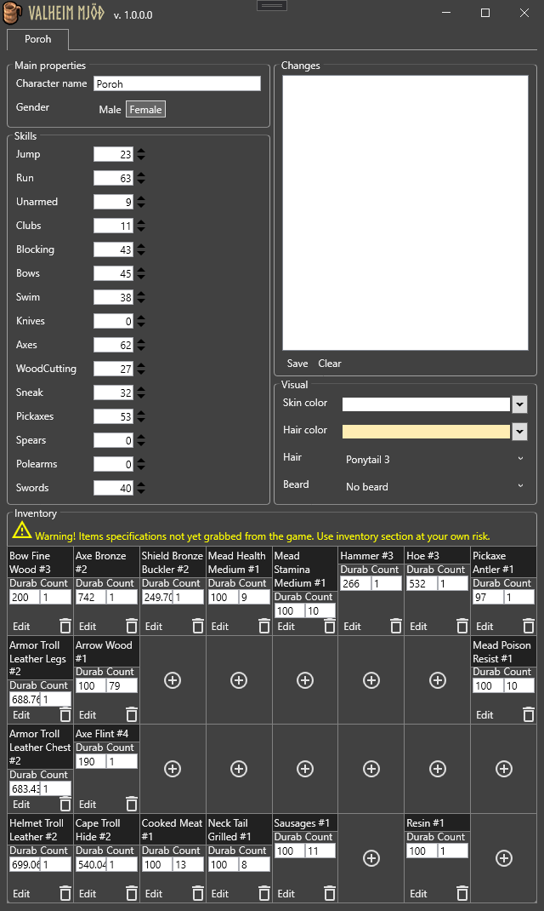

# Valheim Mjöð 
Valheim teach us: drink mead - and you characteristics will change. But we need moar. Use truly nordic mjöð - and ALL you characteristics can be changed forewer (including inventory).

Download binaries from [releases page](https://github.com/porohkun/ValheimMjod/releases)
## How it looks
