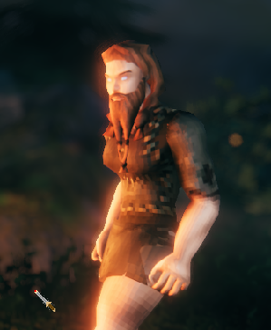
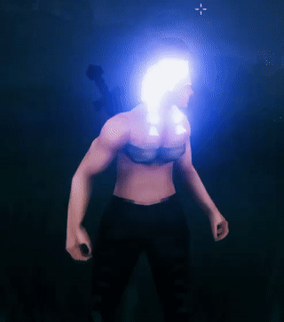
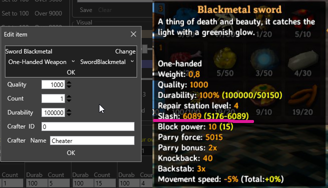

# Valheim Mjöð 
Valheim teach us: drink mead - and you characteristics will change. But we need moar. Use truly nordic mjöð - and ALL you characteristics can be changed forewer (including inventory).

This is not a mod, this is only character editor - will work with local game or any server.

Download [last version](https://github.com/porohkun/ValheimMjod/releases/download/v0.6.0/ValheimMjod-0.6.0-Setup.exe)
## Features
### - Rename character
### - Change gender
### - Visual modifications:
want bearded woman? or maybe mysterious glowing?

 

### - Skills!
running on 'Run' skill 1000/100:

jumping on 'Jump' skill 1000/100:

### - Inventory full access
psst, want sword of your dreams?

## How it boring looks in real

